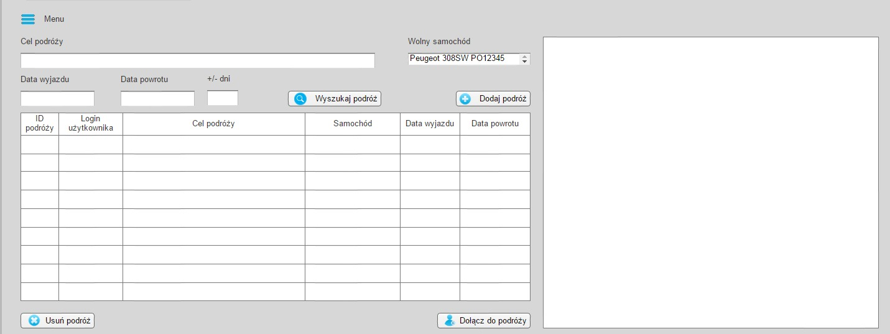

Go Our Car
==========

| Łukasz Majchrzak
| Piotr Martyła
| Bartosz Piętka
| Amadeusz Smirnow
| Marcin Tylek

Cel
---
Celem aplikacji Go Our Car jest zarządzanie podróżami służbowymi w średnich i dużych przedsiębiorstwach. Aplikacja podaje najkrótszą trasę prowadzącą do celu. 

Narzędzia
---------

* Microsoft Visual Studio 2013
* Git
* SQL Server
* Axure
* Bizagi Modeler
* Google Docs
* Tablica Scrumowa

Prototyp aplikacji
------------------

Diagram BPMN
++++++++++++

.. image:: img/USER FLOW.png
   :width: 1100px

Schemat w Axure
+++++++++++++++

Ekran logowania

Schemat w Axure
+++++++++++++++

Ekran główny

Schemat w Axure
+++++++++++++++

Ekran administracyjny

Schemat w Axure
+++++++++++++++

Ekran raportowania

Product backlog
---------------

Tablice SCRUM
-------------

Tablica - dzień #1
++++++++++++++++++

Tablica - dzień #2
++++++++++++++++++

Tablica - dzień #3
++++++++++++++++++

Tablica - dzień #4
++++++++++++++++++

Definition of done
------------------

* Kod źródłowy załadowany na serwer - GitHub
* Testy manualne (akceptacyjne) przeprowadzone przez członków zespołu
* Prezentacja aplikacji/systemu dla Product Ownera
* Dodawanie nowych funkcji bez usuwania lub uszkodzenia bazy danych
* Działanie aplikacji na dwóch komputerach z systemem Windows 7

Funkcje aplikacji
-----------------

Ekran główny
++++++++++++

* Dodanie/Usunięcie podróży
* Dołączenie do istniejącej podróży
* Wyszukanie podróży
* Wyświetlenie podróży
* Wyświetlenie trasy podróży na mapie

Ekran administracyjny
+++++++++++++++++++++

* Dodanie/Usunięcie użytkownika
* Przywrócenie użytkownika
* Dodanie/Usunięcie pojazdu
* Przywrócenie pojazdu

Ekran raportów
++++++++++++++

* Wyświetlenie wszystkich podróży
* Wyświetlenie podróży w zadanym okresie
* Eksportowanie do Excela/PDF-a/Worda

Testowanie aplikacji
--------------------

Testy manualne
++++++++++++++

* Kilkadziesiąt testów manualnych dotyczących podstawowych funkcjonalności naszej aplikacji

Testy jednostkowe
+++++++++++++++++

* Kilkanaście testów jednostkowych dotyczących działania panelu administracyjnego

Dziękujemy za uwagę!
--------------------

